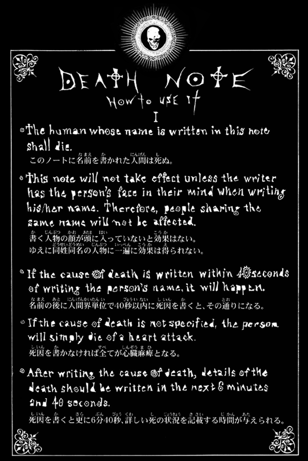

&nbsp;**ABOUT ME**

🔳 I'm Vert, 21 years old currently studying @MSU-IIT

### - Learning :
- 🔗 Cybersecurity
- 🔗 Ethical Hacking

### - Hobbies : 
- 🔗 Gaming Addict
- 🔗 Watching Anime

 
 
 

## 🛠️ Skills

  <!-- Row 1 -->
    

  <!-- Row 2 -->
  
  &nbsp;&nbsp;&nbsp;
    

  <!-- Row 3 -->
  
  &nbsp;&nbsp;&nbsp;
  
  &nbsp;&nbsp;&nbsp;
  
  

 
 
 
 
 
 

