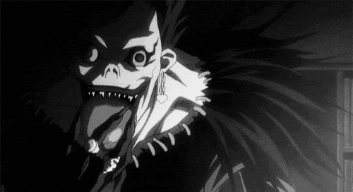

# Konichiwa 👋

 
 
 

# About ME 💬 :

### - I'm 10101 years old 

### - Learning :
- 🔗 Cybersecurity
- 🔗 Ethical Hacking

### - Hobbies : 
- 🔗 Gaming Addict
- 🔗 Watching Anime

 
 
 

---
## Skill Set:
<a href="https://github.com/vertesrael0x2102">

  
        

</a>
 </td><td valign="top" width="25%">

# ⚔️ Berserk Tribute  
Berserk (ベルセルク) is a dark fantasy manga created by **Kentaro Miura**, later adapted into anime.  
It follows the journey of **Guts**, the Black Swordsman — a lone mercenary wielding an enormous sword — as he battles against fate, betrayal, and monstrous forces beyond human comprehension.  

  
  
  
  
  

